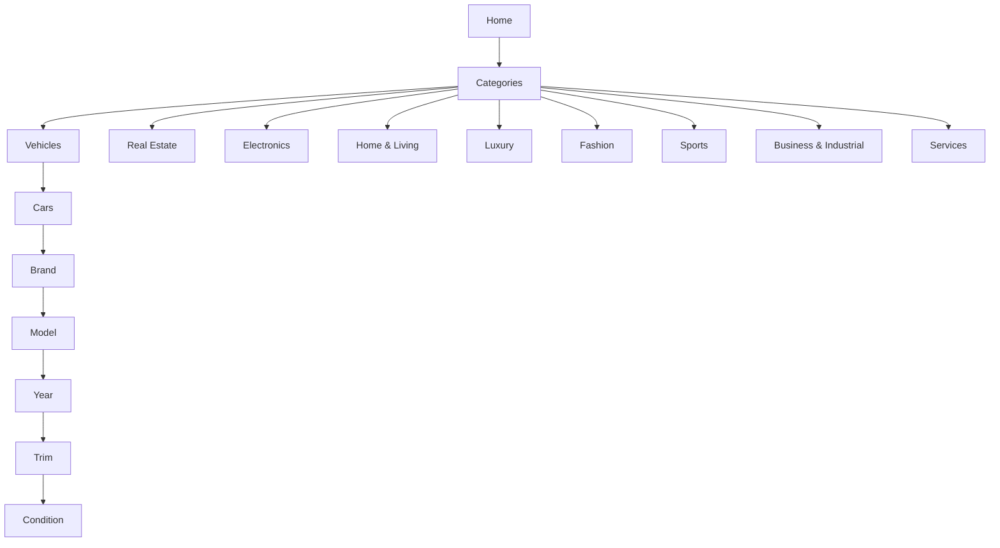

# AGENT.md — Mazad.com MVP Delivery Agent

> Single source of truth for an autonomous/code-assist agent to deliver Mazad.com’s MVP documentation & scaffolding. Optimized for Next.js, TypeScript, and product documentation outputs.

---

## 1) Mission & Outcome
**Mission:** Produce a complete, developer-ready package for Mazad.com’s marketplace MVP: category trees, deep Vehicles taxonomy (brand→model→year→trim→condition), buyer/seller user stories, and phased roadmap. Deliver artifacts consumable by product, design, and engineering.

**Primary Outcomes:**
- **Docs:** Structured user stories, acceptance criteria, and phase plan (MVP1–3).
- **Data:** Excel/CSV + JSON catalogs for categories, subcategories, filters, and vehicle brand/model/trim/year.
- **UI Spec:** Category tree/menu spec with wireframe-ready component annotations.
- **Dev Scaffold:** Next.js app shell (TypeScript) with routes/pages for categories, listing view, and filter schema JSON.

**Non-Goals:** Payment gateway coding, production infra, mobile apps.

---

## 2) Operating Modes
- **Plan Mode:** Draft and refine scopes, stories, and acceptance criteria.
- **Synthesize Mode:** Generate structured CSV/JSON catalogs.
- **Scaffold Mode:** Create a minimal Next.js (App Router) project with pages, sample components, and mock data.
- **Spec Mode:** Produce visual-ready docs (wireframe notes, IA diagrams in Markdown + Mermaid).

---

## 3) Constraints & Quality Bar
- Align with **Saudi market** taxonomy (Vehicles, Real Estate, Luxury, Electronics, Home & Living, Fashion, Sports, Business & Industrial, Services).
- Vehicles must support **Brand → Model → Year → Trim → Condition (New/Used)** and unlock used-only filters (mileage, owners, accident history, warranty).
- All lists must be **deduplicated**, **spell-checked**, and **normalized** (machine-friendly keys + human labels).
- JSON output must **validate** against provided schemas.
- Docs must be **Jira/Trello-ready**: story titles, descriptions, ACs, labels.

---

## 4) Deliverables (By Phase)
### Phase 1 — Core Foundation
- **P1-D1:** Category Tree (All 9 super-categories, subcategories, filters) — Markdown + JSON
- **P1-D2:** Vehicles Deep Taxonomy — CSV/Excel (brand, model, year_range, trims[]), plus JSON
- **P1-D3:** Buyer & Seller Core Stories — Markdown (EPICs → stories → ACs)
- **P1-D4:** UI IA Spec — Markdown with Mermaid: global nav, category menu, listing detail info blocks
- **P1-D5:** Next.js Scaffold — TS, App Router, basic category browsing and filter mocks

### Phase 2 — Trust & Growth
- **P2-D1:** “Mazad Certified” policy (criteria, workflow, badge rules)
- **P2-D2:** Ratings & Reviews model + stories + JSON schema
- **P2-D3:** Buyer/Seller dashboards (stories, route map, mock JSON)
- **P2-D4:** Notifications (outbid, ending soon) — stories & event payload schema

### Phase 3 — Monetization & Scale
- **P3-D1:** Featured Listings, Boosts — pricing matrix + stories
- **P3-D2:** Seller Plans (tiers, limits, analytics) — stories + JSON pricing config
- **P3-D3:** Advanced filters (VIN lookup, AI price estimator) — stories & API interface contracts

---

## 5) Repository Layout (generated in Scaffold Mode)
```
mazad/
  docs/
    00-overview.md
    10-category-tree.md
    20-vehicles-taxonomy.md
    30-user-stories-buyer.md
    31-user-stories-seller.md
    32-acceptance-criteria.md
    40-ia-menu-spec.md
    50-roadmap-mvp1-3.md
  data/
    categories.json
    filters.json
    vehicles/
      brands.csv
      models.csv
      trims.csv
      vehicles.json
  app/ (Next.js App Router)
    layout.tsx
    page.tsx
    categories/
      page.tsx
      [slug]/page.tsx
      cars/
        page.tsx
        [brand]/[model]/page.tsx
    components/
      CategoryMenu.tsx
      FilterPanel.tsx
      ListingCard.tsx
  schemas/
    categories.schema.json
    vehicles.schema.json
    filters.schema.json
  scripts/
    validate-json.mjs
    generate-vehicles-json.mjs
  package.json
  README.md
```

---

## 6) Acceptance Criteria (Global)
- **AC-01**: `data/categories.json` contains all super-categories and subcategories with stable slugs.
- **AC-02**: `data/filters.json` defines filter configs per category (name, type, options/source, conditional rules).
- **AC-03**: Vehicles JSON includes: brand, model, `year_min`, `year_max`, `trims[]`, `condition` values (New/Used) and conditional used-only attributes.
- **AC-04**: JSON validates against schemas in `/schemas` via `npm run validate`.
- **AC-05**: Next.js app boots, renders category menu, and lists sample items using mock data.
- **AC-06**: Docs provide EPICs → stories → ACs for buyer & seller, mapping to Phase 1–3 labels.

---

## 7) User Story Structure Template
```md
**Story Title:** <Concise, action-oriented>
**As a** <buyer|seller|admin>, **I want** <capability>, **so that** <benefit>.

**Acceptance Criteria**
- Given … When … Then …
- Data validation rules
- Empty/edge states
- Analytics events (if any)

**Non-Functional**
- Performance/Snappiness
- Accessibility
- i18n readiness (ar/en)

**Dependencies:** <links to data/docs>
**Phase:** MVP1|MVP2|MVP3
**Labels:** Buyer, Seller, Vehicles, RealEstate, Trust, Monetization
```

---

## 8) Seed Story Lists (Phase 1 excerpt)
### Buyer — Core
- Browse categories and subcategories
- Search and filter (category→brand→model→year→trim→condition)
- Sort (price, newest, ending soon, popularity)
- View listing detail (photos, video, specs, seller rating, inspection report)
- Bid on auction / Buy Now

### Seller — Core
- Create listing (choose category & subcategory, item details, media)
- Choose mode (Auction | Buy Now), set starting bid, reserve, duration
- Vehicles: brand, model, year, trim, condition; used-only fields
- Preview & publish; edit after publish

> Full story sets and ACs to be generated into `docs/30-user-stories-buyer.md` and `docs/31-user-stories-seller.md`.

---

## 9) Vehicles Taxonomy Spec (Data Contract)
```json
{
  "brand": "Toyota",
  "models": [
    {
      "name": "Land Cruiser",
      "years": { "min": 1990, "max": 2026 },
      "trims": ["GXR", "VXR", "ZX", "GR Sport"]
    }
  ]
}
```
- **Keys:** machine-friendly slugs (`toyota`, `land-cruiser`, `gxr`).
- **Used-only fields:** `mileage_km`, `owners_count`, `accident_history`, `warranty_status`.

---

## 10) Category Filters Spec (example excerpt)
```json
{
  "vehicles.cars": {
    "filters": [
      { "key": "brand", "type": "select", "source": "vehicles.brands" },
      { "key": "model", "type": "select", "source": "vehicles.models", "dependsOn": "brand" },
      { "key": "year", "type": "range", "min": 1990, "max": 2026 },
      { "key": "trim", "type": "select", "source": "vehicles.trims", "dependsOn": "model" },
      { "key": "condition", "type": "segmented", "options": ["new", "used"] },
      { "key": "mileage", "type": "range", "visibleWhen": { "condition": "used" } },
      { "key": "owners", "type": "number", "visibleWhen": { "condition": "used" } }
    ]
  }
}
```

---

## 11) IA & Menu Spec (Mermaid)


---

## 12) Next.js Scaffold Spec
- **Stack:** Next.js (App Router), TypeScript, Tailwind, shadcn/ui (optional), ESLint/Prettier.
- **Routes:** `/categories`, `/categories/[slug]`, `/categories/cars`, `/categories/cars/[brand]/[model]`.
- **Mock Data:** read from `/data/*.json` at build time.
- **Components:** `CategoryMenu`, `FilterPanel`, `ListingCard`.
- **Scripts:** `npm run validate` runs `scripts/validate-json.mjs` with AJV.

**Example component contracts:**
```ts
// types.ts
export type FilterOption = { value: string; label: string };
export type CategoryFilter = {
  key: string;
  type: 'select'|'range'|'segmented'|'number';
  options?: FilterOption[];
  source?: string;
  dependsOn?: string;
  visibleWhen?: Record<string, string>;
};
```

---

## 13) Commands (Agent Checklist)
1. **Plan Mode**
   - [ ] Generate `docs/50-roadmap-mvp1-3.md` with scope & effort per phase
   - [ ] Generate story docs with ACs
2. **Synthesize Mode**
   - [ ] Produce `data/categories.json`, `data/filters.json`
   - [ ] Produce Vehicles CSVs and `vehicles.json`
   - [ ] Run JSON schema validation
3. **Scaffold Mode**
   - [ ] Create Next.js app, install deps, add pages/components
   - [ ] Import mock data, render category menu and filters
4. **Spec Mode**
   - [ ] Output IA diagrams (Mermaid) and wireframe notes

---

## 14) Definition of Done
- All data files validate against schemas
- Next.js dev server runs and renders menu + sample category
- Docs complete with ACs and clearly labeled phases
- Vehicles taxonomy covers top KSA brands & models; trim lists populated for top-5 models at minimum

---

## 15) File Output Requirements
- **Docs:** Markdown (UTF-8) under `/docs`
- **Data:** JSON + CSV under `/data`
- **Schemas:** JSON Schema Draft-07
- **Code:** Next.js app compiles without TypeScript errors

---

## 16) Naming & Slugging Conventions
- Kebab-case for slugs: `land-cruiser`, `mazad-certified`
- Snake_case for CSV headers if needed
- Human-readable `label`, machine `value`

---

## 17) i18n Readiness
- Prepare keys in `data/i18n/en.json` and `data/i18n/ar.json` (phase 2+)
- Avoid hard-coded UI strings in components

---

## 18) Risk & Mitigation
- **Scope creep:** Phased deliverables with hard ACs
- **Data completeness:** Start with top-20 brands, iterate
- **UX ambiguity:** Wireframe notes + IA diagrams

---

## 19) License & Ownership
- All generated artifacts are work-for-hire for Mazad.com; ensure no third-party proprietary data is embedded.

---

## 20) Kickoff Checklist (for the agent)
- [ ] Create repository structure
- [ ] Generate initial docs & schemas
- [ ] Populate categories & filters JSON
- [ ] Seed Vehicles taxonomy (Toyota, Nissan, Hyundai, Kia, Ford, Lexus, BMW, Mercedes)
- [ ] Scaffold Next.js app with sample pages
- [ ] Validate JSON and run typecheck
- [ ] Produce Phase 1 handoff summary

