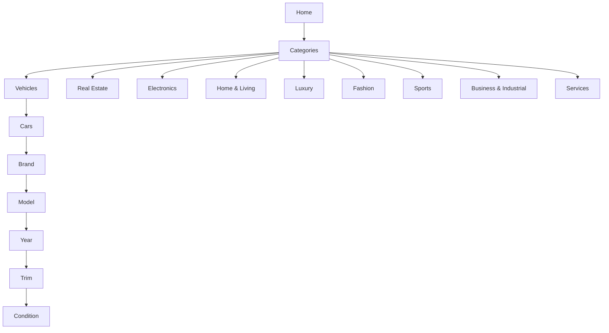

# Information Architecture & Menu Spec

## Global Navigation
- Top nav includes logo, mega menu trigger, search bar, language toggle (EN/AR), and user menu.
- Mega menu surfaces all nine super-categories with supporting imagery.
- Hovering a super-category reveals secondary panel with subcategories and quick filters.

## Category Navigation Flow

## Page Templates
### Categories Index (`/categories`)
- Grid layout with cards per super-category.
- Card contents: icon, label, description, CTA button (“Browse Vehicles”).
- Secondary column highlights featured stories (e.g., “Mazad Certified explained”).

### Category Detail (`/categories/[slug]`)
- Hero banner with category imagery and description.
- Subcategory list with counts (powered by supply metrics).
- Filter chips for top queries (e.g., `SUVs under SAR 200K`).
- SEO block with FAQ accordion.

### Vehicles Brand Model (`/categories/cars/[brand]/[model]`)
- Header showing brand + model + production years.
- Trim cards list engine, drivetrain, transmission, price guidance.
- Sticky filter panel on desktop referencing `FilterPanel` component.
- Related content: certification info, financing CTA placeholder.

## Component Contracts
### `CategoryMenu`
- Props: `{ categories: Category[] }`
- Behavior: renders mega menu tree, handles slug-based routing.
- Responsive: collapses to accordion on mobile.

### `FilterPanel`
- Props: `{ filters: CategoryFilter[], state: Record<string, unknown> }`
- Renders segmented control, select dropdowns, and range sliders based on filter type.
- Applies conditional visibility using `visibleWhen` property.

### `ListingCard`
- Props: `{ listing: ListingSummary }`
- Displays image, title, key specs (price, mileage, location), badges (Certified, New/Used).
- On click navigate to detail page using Next.js `<Link>`.

## Wireframe Notes
- Desktop width: 1440px grid with 12 columns; mobile: 375px.
- Hero sections use 60/40 text-to-image split with CTA for seller onboarding.
- Listing grid uses 3 columns on desktop, 2 on tablet, 1 on mobile.
- Sticky bid widget on detail page shows countdown timer and call-to-action.

## Accessibility & Localization
- All nav items accessible via keyboard with visible focus states.
- Language toggle updates `dir` attribute for Arabic in future release.
- Icons accompanied by text labels to maintain clarity for screen readers.
